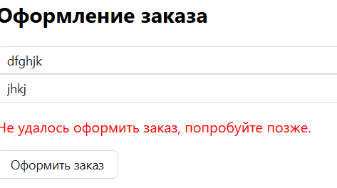
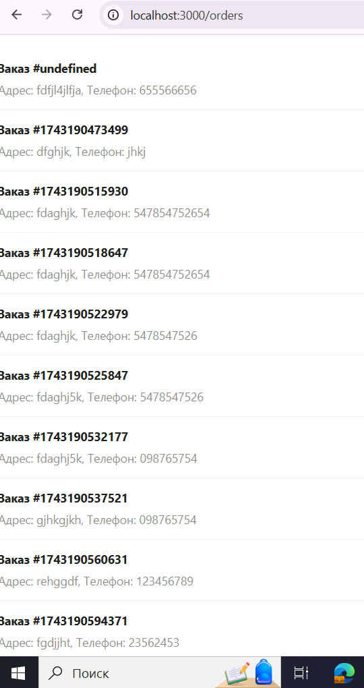

# Функциональность оформления заказа
Теперь пользователи могут оформлять заказы и просматривать их в личном кабинете. Это включает несколько страниц и состояния, связанные с заказами.

# Страница оформления заказа (Checkout.jsx)
 Страница для оформления заказа, где пользователи могут ввести свой адрес и номер телефона для завершения покупки.

## Функции:

- Поля для ввода адреса и телефона.

- Кнопка для оформления заказа, которая отправляет данные на сервер и перенаправляет пользователя на страницу подтверждения.

- Ошибки валидации: Если пользователь не заполнил все поля, появляется сообщение об ошибке.

# Страница с заказами (Orders.jsx)
Страница, на которой отображаются все заказы, сделанные текущим пользователем. Это дает пользователю возможность просматривать историю своих покупок.

## Функции:

Отображение заказов пользователя: Использует Zustand для хранения состояния заказов.

Простое отображение: Для каждого заказа выводится информация о нем (например, адрес и телефон).

### Изменения в 24.03.2025

- Исправлено: сообщение о последнем коммите было уточнено для улучшения понимания.
- Добавлена функция для фильтрации товаров по цене с использованием ползунка.
- Исправлены ошибки с добавлением/удалением товаров из корзины и избранного.
